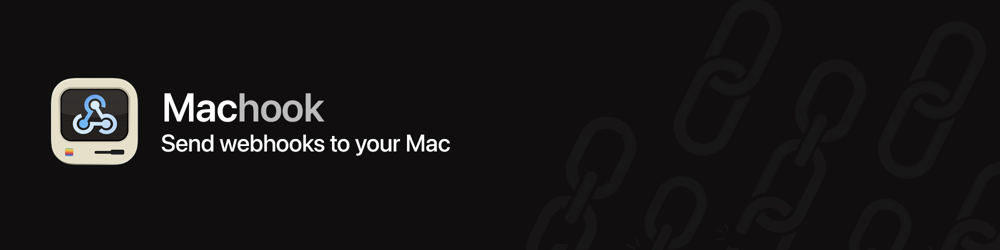

# Machook

> Give any webhook a shell on your Mac. Map a URL path to a command, expose it through a **Cloudflare Tunnel**, and get the command's output back as the HTTP response. Every endpoint is simultaneously an **MCP tool**, so an AI client can call the same commands.

[](./LICENSE)
[](./src)
[](./src/Package.swift)
[](#cloudflare-tunnel-two-modes)
[](#mcp-every-endpoint-is-a-tool)

A native macOS menu bar app. No dock icon, no Xcode, no system permissions to grant: Machook listens on `127.0.0.1` and runs the commands you configure. The only thing it needs from you is a decision about what to expose.

```
POST https://your-tunnel.example.com/deploy
        │
        ├─ bearer token checked
        ├─ request written to a private temp file
        ├─ your command runs:  bash ~/deploy.sh {{request}}
        └─ stdout returned, 200 (or 500 with stderr on a non-zero exit)
```

**Jump to:** [Quickstart](#quickstart) · [Your first endpoint](#your-first-endpoint) · [The request envelope](#the-request-envelope) · [Responses](#responses) · [MCP](#mcp-every-endpoint-is-a-tool) · [Security](#security-model) · [Configuration](#configuration)

---

## Contents

- [Why](#why)
- [Quickstart](#quickstart)
- [Install](#install)
- [Your first endpoint](#your-first-endpoint)
- [The request envelope](#the-request-envelope)
- [Endpoints](#endpoints)
- [Responses](#responses)
- [MCP: every endpoint is a tool](#mcp-every-endpoint-is-a-tool)
- [Security model](#security-model)
- [Cloudflare Tunnel, two modes](#cloudflare-tunnel-two-modes)
- [Configuration](#configuration)
- [Built-in API](#built-in-api)
- [Development](#development)
- [License](#license)

## Why

Plenty of services will call a webhook. Almost nothing will let that webhook run something on the machine where your work actually lives — the Mac with your SSH keys, your `~/Projects`, your Homebrew toolchain, your Photos library, your Xcode.

The usual answers are a VPS you have to deploy to, a tunnel you have to babysit, and a small HTTP server you have to write again for every project. Machook is that layer, done once:

- **A table of endpoints**, edited in a GUI: path, command, methods, timeout, working directory.
- **The whole request as one JSON file**, handed to your script as an argument. No parsing HTTP in bash.
- **Synchronous responses**: stdout becomes the body, the exit code becomes the status.
- **A Cloudflare Tunnel** managed for you, including the bundled `cloudflared`.
- **An MCP server** over the same endpoint table, so Claude or any MCP client can invoke the same commands as tools.
- **One security boundary you can actually check**, described in full [below](#security-model).

## Quickstart

```bash
# 1. Open Settings from the menu bar icon.
# 2. General → set a bearer token (any long random string).
# 3. Endpoints → + and add:
#      Path:    /hello
#      Command: echo "hi from $(hostname)"
# 4. Test it locally:
curl -H "Authorization: Bearer <your-token>" -d '{}' http://127.0.0.1:7876/hello
# hi from your-mac.local

# 5. Tunnel → toggle on (Quick mode needs no Cloudflare account).
# 6. Copy the public URL from the menu bar and call it from anywhere:
curl -H "Authorization: Bearer <your-token>" -d '{}' https://<random>.trycloudflare.com/hello
```

## Install

### From a release

1. Download `machook-universal.dmg` from the [releases page](https://github.com/ranaroussi/machook/releases). One build runs on both Apple Silicon and Intel Macs (macOS 14+).
2. Drag **Machook.app** to **Applications** and open it.
3. Click the menu bar icon → **Settings…**

Releases are code-signed with a Developer ID, notarized when CI credentials are configured, and update themselves through Sparkle.

### From source

```bash
git clone https://github.com/ranaroussi/machook.git
cd machook

make app        # build + bundle + sign  →  ./Machook.app
make install    # same, then copy to /Applications
make run        # build and launch
make test       # 79 unit tests
```

Requirements: macOS 14+, Swift 6.0+ (Xcode command line tools are enough), and `cloudflared` if you want the bundler to pick up a local copy rather than downloading one.

## Your first endpoint

A real example: a webhook that pulls and restarts a project.

**1. Write the script.** It receives one argument, the path to a JSON file describing the request.

```bash
#!/bin/bash
# ~/bin/deploy.sh
set -euo pipefail

request="$1"
branch=$(jq -r '.body.ref // "refs/heads/main"' "$request")

if [[ "$branch" != "refs/heads/main" ]]; then
  echo "ignoring $branch"
  exit 0
fi

cd ~/Projects/myapp
git pull --ff-only
./restart.sh
echo "deployed $(git rev-parse --short HEAD)"
```

**2. Add the endpoint** in Settings → Endpoints:

| Field | Value |
|---|---|
| Path | `/deploy` |
| Command | `bash ~/bin/deploy.sh {{request}}` |
| Methods | `POST` |
| Timeout | `120` |

**3. Test it** with the **Test** button in the endpoint editor, or by hand:

```bash
curl -H "Authorization: Bearer $TOKEN" \
     -H 'Content-Type: application/json' \
     -d '{"ref":"refs/heads/main"}' \
     https://<your-tunnel>/deploy
# deployed 4f2a1c9
```

**4. Point GitHub at it**: repository → Settings → Webhooks → your tunnel URL + `/deploy`.

### Something to test against first

Before wiring up anything real, [`examples/log-request.sh`](examples/log-request.sh)
gives you an endpoint that records every request it receives to
`~/Library/Logs/machook/requests.log` and answers with a summary of what it saw:

| Field | Value |
|---|---|
| Path | `/log` |
| Command | `bash /path/to/machook/examples/log-request.sh {{request}}` |
| Methods | `POST, GET` |

```bash
curl -sS -X POST 'http://127.0.0.1:7876/log?source=test' \
  -H 'Content-Type: application/json' -d '{"event":"push"}'

tail -40 ~/Library/Logs/machook/requests.log
```

Add `?fail=1` to any request to see the failure mapping (500, with stderr as the
body). See [`examples/README.md`](examples/README.md) for the rest.

## The request envelope

Everything about the request is written to a JSON file, and `{{request}}` in your command is replaced by that file's path. This is the only way request data reaches your script: nothing is interpolated into the command line, and nothing is piped to stdin.

```json
{
  "body" : {
    "ref" : "refs/heads/main"
  },
  "body_bytes" : 26,
  "body_raw" : "{\"ref\":\"refs/heads/main\"}",
  "headers" : {
    "content-type" : "application/json",
    "user-agent" : "GitHub-Hookshot/abc123",
    "x-github-event" : "push"
  },
  "id" : "25bf2c35",
  "method" : "POST",
  "path" : "/deploy",
  "query" : {
    "dry" : "1"
  },
  "received_at" : "2026-09-09T21:21:47.595Z",
  "source" : "http"
}
```

| Key | Notes |
|---|---|
| `id` | Short run identifier, also used in the log and the filename. |
| `received_at` | ISO 8601 with fractional seconds, UTC. |
| `source` | `http` for a webhook, `mcp` for a tool call. |
| `method` | HTTP verb, or `MCP` for a tool call. |
| `path` | Normalized endpoint path. |
| `query` | Parsed query string. |
| `headers` | Lowercased names. **`authorization` is removed** so your token never lands on disk. |
| `body` | Parsed JSON when the body is JSON, otherwise `null`. |
| `body_raw` | The body as text, always present when it is valid UTF-8. |
| `body_bytes` | Byte count of the raw body. |
| `body_base64` | Only for bodies that are not valid UTF-8. |

Practical notes:

- The file lives in a per-user directory (`$TMPDIR/machook/requests`, mode `0700`) with mode `0600`, and is **deleted as soon as your command exits**. Turn on *Keep request files* in Settings while you are writing a script; leave it off otherwise, because payloads carry secrets.
- The same path is also exported as `MACHOOK_REQUEST_FILE`, so a script can find it without an argument.
- `stdin` is `/dev/null`. A script that calls `cat` or `read` will not hang waiting for input.
- Leftover files older than six hours are swept at launch.

## Endpoints

Each row in the endpoint table has these fields:

| Field | Default | Meaning |
|---|---|---|
| `path` | — | Request path, normalized to a leading slash with no trailing slash. A pasted full URL or query string is cleaned up for you. `/health`, `/status`, and `/mcp` are reserved. |
| `command` | — | Shell command template. `{{request}}` is substituted with the envelope path; no other placeholder is supported. |
| `methods` | `POST` | Accepted verbs. Empty means any of GET, POST, PUT, PATCH, DELETE. |
| `enabled` | on | Off returns `503` instead of `404`, so a disabled endpoint is distinguishable from a typo. |
| `timeoutSeconds` | `30` | Wall clock. On expiry: SIGTERM, then SIGKILL two seconds later, and the caller gets `504`. Range 1–3600. |
| `workingDirectory` | `$HOME` | Must exist, or the endpoint is refused at save time and at request time. |
| `toolDescription` | — | Human description, and the text an AI model reads when deciding whether to call the tool. |
| `mcpEnabled` | on | Whether this endpoint appears in `tools/list`. |
| `mcpToolName` | derived | Overrides the name; the default is the path with separators collapsed (`/github/push` → `github_push`). Collisions get a numeric suffix. |
| `mcpInputSchema` | freeform | Optional JSON Schema object for the tool's arguments. |
| `mcpReadOnly` | off | Marks the tool read-only. Left off, MCP treats the tool as potentially destructive, which is the right default for a shell command. |

Endpoints are resolved against the live configuration on **every request**, so adding, editing, or disabling one takes effect immediately with no restart. Matching is exact: one URL, one command, no prefix or pattern rules to reason about.

## Responses

| Situation | Status | Body |
|---|---|---|
| Exit 0 with output | `200` | stdout verbatim, with a sniffed `Content-Type` (JSON, text, HTML) |
| Exit 0, no output | `200` | `{"ok":true,"exit_code":0,"duration_ms":15}` |
| Non-zero exit | `500` | `{"error":"Command exited 7","stderr":"…","exit_code":7}` |
| Timed out | `504` | `{"error":"Command timed out after 30012 ms","exit_code":15}` |
| No such endpoint | `404` | `{"error":"No endpoint configured for /nope"}` |
| Wrong verb | `405` | `{"error":"/deploy accepts POST"}` |
| Endpoint disabled | `503` | `{"error":"Endpoint /deploy is disabled"}` |
| Too many runs in flight | `503` | Retry later; the cap is `maxConcurrentRuns` |
| Missing or bad token | `401` | `{"error":"Missing or invalid bearer token. …"}` plus `WWW-Authenticate: Bearer` |

Every endpoint response also carries:

```
X-Machook-Exit-Code: 0
X-Machook-Duration-Ms: 29
X-Machook-Truncated: true      # only when output hit the cap
```

## MCP: every endpoint is a tool

`POST /mcp` speaks MCP JSON-RPC over HTTP. The tool catalog is generated from the endpoint table at request time, so a tool exists exactly as long as its endpoint does.

```bash
curl -H "Authorization: Bearer $TOKEN" \
     -H 'Content-Type: application/json' \
     -H 'Accept: application/json' \
     -d '{"jsonrpc":"2.0","id":1,"method":"tools/list"}' \
     https://<your-tunnel>/mcp
```

```json
{"result":{"tools":[
  {"name":"deploy","description":"Pull and restart myapp",
   "inputSchema":{"type":"object","properties":{},"additionalProperties":true}}
]}}
```

Calling a tool runs the same command against the same envelope shape as an HTTP request, with `source` set to `mcp` and the tool arguments delivered as `body`:

```bash
curl -H "Authorization: Bearer $TOKEN" \
     -H 'Content-Type: application/json' -H 'Accept: application/json' \
     -d '{"jsonrpc":"2.0","id":2,"method":"tools/call",
          "params":{"name":"deploy","arguments":{"ref":"refs/heads/main"}}}' \
     https://<your-tunnel>/mcp
```

Point an MCP client at it:

```json
{
  "mcpServers": {
    "machook": {
      "url": "https://<your-tunnel>/mcp",
      "headers": { "Authorization": "Bearer <your-token>" }
    }
  }
}
```

Endpoints with MCP switched off are invisible to `tools/list` and refused by `tools/call`. The master switch is General → *Expose endpoints over MCP*.

## Security model

Machook runs arbitrary commands on your Mac in response to network requests. That is the entire point, and it deserves a clear-eyed description.

**What is exposed.** The HTTP server binds `127.0.0.1` only. Nothing is reachable from outside until you enable the tunnel, and then the only exposed surface is the endpoint table you wrote.

**The one gate.** A single bearer token guards every route except `GET /health`. It is compared in constant time, and a failure is logged. An empty token disables authentication entirely — fine on localhost, catastrophic with the tunnel on, so Settings shows a standing warning and makes you confirm that exact combination through a separate "Publish anyway" prompt before it saves.

**The injection boundary.** This is the invariant worth internalizing:

> The command template you typed in Settings is the only string the shell ever parses. Everything that arrives over the network reaches your command as a single-quoted argv element or as a path to a file.

`{{request}}` expands to a quoted file path. A body containing `` $(rm -rf ~); `id` `` is data inside a JSON file, not code. The quoting is deliberately conservative: values pass through unquoted only when every character is provably inert, and `=` and `~` are excluded because zsh expands them in ways that surprise people. There are unit tests for exactly this.

**What Machook does not protect you from.** Your own commands. If a script feeds `.body.name` into `eval`, or `curl | bash`es something a payload chose, the shell will do as it is told. Treat the envelope as untrusted input, because it is.

**Sensible practice**

- A long random token, rotated when it leaks. Not `test`.
- Named tunnels for anything permanent, with Cloudflare Access in front if the sender supports it.
- Narrow commands over general ones: `bash ~/bin/deploy.sh` beats `bash -c "$(jq -r .cmd)"`.
- Short timeouts and a low concurrency cap, so a retry storm cannot fork-bomb the machine.
- *Keep request files* off outside debugging.
- No system permissions are needed. If a command wants Full Disk Access or Automation, macOS will prompt on behalf of that command, not the app.

## Cloudflare Tunnel, two modes

| | Quick | Named |
|---|---|---|
| Cloudflare account | not needed | required |
| URL | `https://<random>.trycloudflare.com` | your own hostname |
| Stability | rotates on every restart | stable |
| Setup | one toggle | create a tunnel, paste its token, add a public hostname → `http://localhost:<port>` |
| Good for | trying it out, one-off receivers | anything a provider or MCP client has saved |

`cloudflared` ships inside the app bundle; Machook supervises it, parses the URL out of its output, restarts it if it dies, and shows the current URL in the menu bar (click to copy). Full walkthrough in [docs/ARCHITECTURE.md](./docs/ARCHITECTURE.md).

The URL is verified before it is presented as working. A quick tunnel is handed its hostname *before* the DNS record exists, so cloudflared reports a healthy connection while nothing can resolve you yet. Machook waits for the record to appear in public DNS and then fetches the URL's `/health` from the outside, so "reachable" in the menu means a request actually completed. Checking in that order matters: asking your Mac for a hostname that does not exist yet makes macOS cache the failure, which would break your own `curl` to a tunnel that came up fine moments later.

If a URL never answers, the menu says why instead of looking ready, and keeps rechecking in case a late DNS record rescues it. For anything you cannot afford to babysit, use a named tunnel: the hostname is stable and the DNS record is one you own.

## Configuration

Everything lives in `UserDefaults` under `com.machook.app`, key `machook.config.v1`, and is edited from Settings. Unknown or missing keys fall back to defaults, so upgrades never reset your endpoint table.

| Setting | Default | Notes |
|---|---|---|
| `bearerToken` | empty | Required on every route but `/health`. Empty means no auth at all. |
| `localAPIPort` | `7876` | Bound on `127.0.0.1`. |
| `fallbackAPIPort` | `7877` | Tried when the primary is taken, because the alternative is an app that looks healthy and answers nothing. The menu bar, the Tunnel tab, and `/status` all name the port that actually bound, and the tunnel follows it rather than the configured number. Set to `0` to insist on the primary and get a loud failure instead. |
| `tunnelEnabled` | off | |
| `tunnelMode` | `quick` | `quick` or `named`. |
| `tunnelToken` | empty | Named mode connector token. |
| `tunnelHostname` | empty | Named mode hostname, bare host with no scheme. |
| `endpoints` | empty | The endpoint table. |
| `mcpEnabled` | on | Master switch for `POST /mcp`. |
| `maxConcurrentRuns` | `4` | Further requests get `503` instead of piling up. |
| `maxOutputKB` | `1024` | Per stream. Output past the cap is discarded but still drained, so the child never blocks. |
| `maxBodyMB` | `10` | Larger bodies are rejected before anything runs. |
| `keepRequestFiles` | off | Debugging aid. |
| `shellPath` | `/bin/zsh` | Interprets the command template. |
| `loginShell` | on | Loads your profile so Homebrew and pyenv resolve. Costs a few hundred ms per request; turn off if every command uses absolute paths. |

## Built-in API

| Route | Auth | Purpose |
|---|---|---|
| `GET /health` | none | Liveness: `{"ok":true}`. The only unauthenticated route. |
| `GET /status` | bearer | Version, tunnel URL and state, port, endpoint and tool counts, runs in flight. |
| `POST /mcp` | bearer | MCP JSON-RPC. |
| everything else | bearer | Your endpoints. |

```bash
curl -s -H "Authorization: Bearer $TOKEN" http://127.0.0.1:7876/status
{"ok":true,"version":"0.1.0","tunnel_url":"https://…","tunnel_running":true,
 "tunnel_reachability":"reachable","tunnel_reachability_note":"",
 "local_api_port":7876,"configured_api_port":7876,
 "endpoints_total":6,"endpoints_enabled":5,
 "mcp_enabled":true,"mcp_tools":2,"active_runs":0}
```

`local_api_port` is the port actually serving; `configured_api_port` is the one in Settings. They differ when the fallback is in use.

`tunnel_running` means the `cloudflared` process is alive. `tunnel_reachability` means the URL was fetched from the outside and answered — `unknown`, `checking`, `reachable`, or `unreachable` with the reason in `tunnel_reachability_note`. Quick tunnels are occasionally handed a hostname Cloudflare never publishes in DNS, and that combination (`running: true`, `unreachable`) is the only warning you will get.

## Development

```bash
cd src
swift build            # debug
swift test             # 79 tests: quoting, templating, envelope, runner, ports, tunnel
swift build -c release

cd .. && make app      # bundle + sign
log stream --predicate 'subsystem == "com.machook.app"'   # live logs
```

The package splits into a thin `Machook` executable and a `MachookCore` library so the logic is testable. See [TESTING.md](./TESTING.md) for the manual matrix, [docs/ARCHITECTURE.md](./docs/ARCHITECTURE.md) for how the pieces fit, and [docs/DISTRIBUTION.md](./docs/DISTRIBUTION.md) for signing, notarization, and cutting a release.

## License

MIT. See [LICENSE](./LICENSE).
